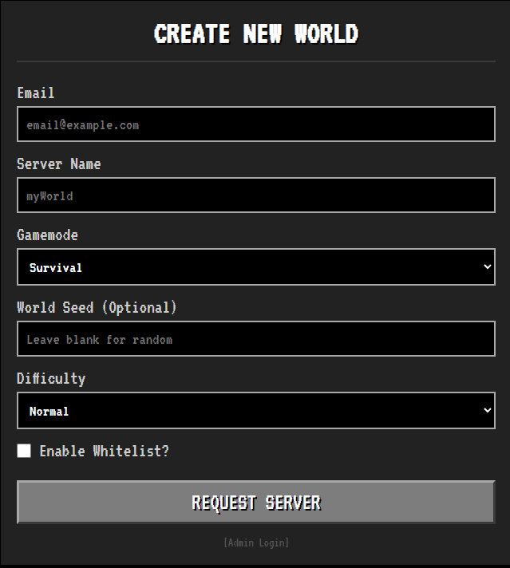

# Proxmox Virtualized Minecraft Orchestrator

A full-stack Infrastructure-as-a-Service (IaaS) platform that automates the deployment and management of Minecraft server instances. This project orchestrates Proxmox LXC containers, Cloudflare DNS, and Velocity Proxy routing into a seamless, self-service hosting environment.
---



---
## 🚀 Key Features

- **Automated Provisioning:** Instant cloning of optimized Ubuntu-based LXC templates via the Proxmox VE API.
- **Dynamic Metadata Injection:** A custom-engineered system that pushes configuration variables (Seed, Difficulty, Game Mode, Whitelist) directly into containers using `pct push` via SSH.
- **Asynchronous Workflow:** Long-running infrastructure tasks (cloning, DNS propagation) are handled in background threads to provide an instantaneous UI experience.
- **Automated Networking:** - Dynamic IP calculation based on VMID offsets (`10.0.10.vmid-200`).
  - Automated Cloudflare Subdomain creation.
  - Automatic Velocity Proxy backend registration.
- **Intelligent Initialization:** A robust Bash entry-script (`mc-init.sh`) that utilizes `jq` for non-destructive JSON manipulation of `whitelist.json` and `ops.json`.

## 🛠️ Tech Stack

- **Backend:** Python (Flask), Gunicorn
- **Virtualization:** Proxmox VE (LXC)
- **Scripting:** Bash, Linux Systemd
- **APIs:** Cloudflare, Proxmox (via `proxmoxer`), Paramiko (SSH)
- **Database:** SQLite
- **Networking:** Velocity Proxy, Cloudflare DNS

## 🏗️ How It Works

1. **Admin Approval:** When a request is approved, the Flask app calculates the next available VMID and IP address.
2. **Orchestration:** A background thread is spawned to handle:
   - Cloning the master LXC template.
   - Creating a Cloudflare DNS record.
   - Updating the Velocity Proxy configuration.
3. **Configuration Injection:** The app pushes a `metadata.txt` file to the container's root directory.
4. **Boot Sequence:** On startup, the `mc-init.sh` script:
   - Reads the metadata.
   - Configures the static IP.
   - Updates `server.properties`.
   - Appends the owner to the existing whitelist without erasing current entries.


## 📂 Project Structure

```text
├── app.py                 # Flask web interface & routing
├── spikeproxmox.py        # Proxmox/LXC orchestration logic
├── spikecloudflare.py     # Cloudflare DNS management
├── spikevelocity.py       # Velocity Proxy backend automation
├── scripts/
│   └── mc-init.sh         # Container-side initialization script
├── templates/             # Admin Dashboard & UI
└── .env.example           # Template for environment variables
```
## 🔧 Installation & Setup

### Proxmox Host
Ensure SSH access is enabled and a base LXC template (ID 128) is prepared with `jq` installed.

### Web App
```bash
git clone [https://github.com/yourusername/proxmox-mc-orchestrator.git](https://github.com/yourusername/proxmox-mc-orchestrator.git)
cd proxmox-mc-orchestrator
pip install -r requirements.txt
```
### Environment Variables: 
Create a .env file with your Proxmox API keys, Cloudflare Token, and SSH credentials.

### Deployment: 
Run via Gunicorn to handle production traffic:

```bash
gunicorn --timeout 120 --workers 3 app:app
```
## 🛡️ Challenges Overcome
### API Limitations: 
Solved the 501 Not Implemented error by pivoting from exec API calls to a robust Host-to-Container file push strategy.

### Race Conditions: 
Implemented a retry-loop in the Bash init script to ensure configuration files are fully injected before the Minecraft server attempts to start.

### Process Timeouts: 
Migrated from synchronous requests to asynchronous threading to bypass Gunicorn worker timeouts during infrastructure heavy-lifting.


